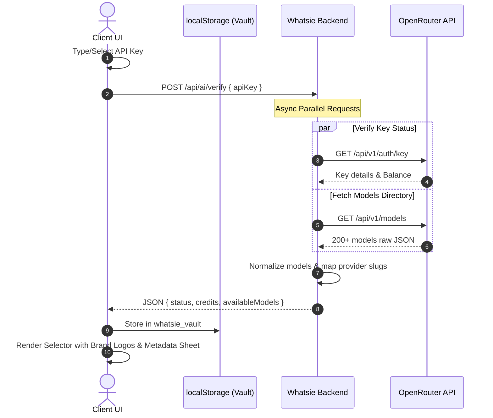

# AI-SPEC.md: Whatsie AI Engine Integration

## Overview & Architecture

The **Whatsie AI Engine** establishes OpenRouter as the single source of truth for all AI model attributes, context limits, and cost metrics, replacing hardcoded list patterns with a dynamic metadata verification pipeline.



---

## 1. The Dynamic Metadata Pipeline (Backend)

### Endpoint Specification
*   **Path:** `POST /api/ai/verify`
*   **Auth:** Requires standard user JWT token (tenant context).
*   **Payload:**
    ```json
    {
      "apiKey": "sk-or-v1-..."
    }
    ```

### Backend Resolution Logic
1.  **Parallel Dispatch:** Dispatch concurrent HTTPS calls to the OpenRouter APIs using Axios or fetch:
    *   `GET https://openrouter.ai/api/v1/auth/key`
    *   `GET https://openrouter.ai/api/v1/models`
2.  **Authentication Header:** Both requests must include: `Authorization: Bearer <apiKey>`.
3.  **Data Normalization:**
    *   Extract balance from `data.limit - data.usage` or from the `limit` / `usage` parameters returned by the OpenRouter key details endpoint.
    *   For each model in `/models`, parse the model `id` (e.g. `meta-llama/llama-3-70b-instruct`) and split it by `/` to extract the `providerSlug` (e.g., `meta-llama`).
    *   Map standard features to a unified client payload.

### Backend Return Contract
*   **Status Code:** `200 OK`
*   **Response Body:**
    ```typescript
    interface VerifyResponse {
      status: "valid" | "invalid" | "no_credits";
      credits: number; // Current balance in USD
      availableModels: Array<{
        id: string; // OpenRouter model ID
        name: string;
        context_length: number;
        pricing: {
          prompt: string;     // Cost per token / million tokens
          completion: string; // Cost per token / million tokens
        };
        providerSlug: string; // meta-llama, anthropic, google, etc.
      }>;
    }
    ```

---

## 2. The Live Brand Resolver (Frontend)

To dynamically display high-resolution provider branding without shipping hundreds of static images, the frontend utilizes the **img.logo.dev** CDN combined with a mapping utility.

export const DOMAIN_MAP: Record<string, string> = {
  "anthropic": "anthropic.com",
  "meta-llama": "meta.com",
  "google": "google.com",
  "mistralai": "mistral.ai",
  "openai": "openai.com",
  "cohere": "cohere.com",
  "perplexity": "perplexity.ai",
  "deepseek": "deepseek.com",
  "qwen": "alibaba.com",
  "microsoft": "microsoft.com",
};

// Brand colors for initial fallback avatars
export const BRAND_COLORS: Record<string, string> = {
  "anthropic": "#D0BC95",
  "meta-llama": "#0668E1",
  "google": "#4285F4",
  "mistralai": "#FF6B00",
  "openai": "#10A37F",
  "cohere": "#3E2616",
  "perplexity": "#18181B",
  "deepseek": "#0052D4",
  "qwen": "#6236FF",
  "microsoft": "#00A4EF",
};

export function getProviderLogoUrls(providerSlug: string): string[] {
  const domain = DOMAIN_MAP[providerSlug] || `${providerSlug}.com`;
  return [
    `https://img.logo.dev/${domain}`,
    `https://logo.clearbit.com/${domain}`,
    `https://icon.horse/icon/${domain}`
  ];
}

export function getBrandColor(providerSlug: string): string {
  return BRAND_COLORS[providerSlug] || "#71717A"; // default gray
}
```

### Dynamic Logo Component Behavior
The frontend UI renders a logo image with an image loader chain:
1. Try loading `img.logo.dev/domain`.
2. On `onError`, switch the source to `logo.clearbit.com/domain`.
3. If that fails too, render an avatar placeholder containing the provider's first letter (e.g. "M" for Meta) with its brand color as background: `style={{ backgroundColor: getBrandColor(providerSlug) }}`.

---

## 3. The "Key Vault" System (Frontend)

To maintain security while streamlining workflow configuration, client-side credentials are saved in a local vault drop-down helper.

### LocalStorage Schema
Keys are stored in local storage under a designated key:
```typescript
interface VaultEntry {
  keyHash: string;      // Masked / truncated display key (e.g. sk-or-...4a9f)
  obfuscatedKey: string; // Base64 + Dynamic salt-shuffled representation of the key
  provider: string;      // e.g. "openrouter"
  lastVerified: string;  // ISO timestamp
  balance: number;
}
```

### Vault Obfuscation Logic (Client-Side)
```typescript
const VAULT_SALT = "whatsie_secure_salt_2026";

export function obfuscateKey(rawKey: string): string {
  // Prepend salt, reverse, and encode to Base64 to bypass extension scanners
  const combined = `${VAULT_SALT}:${rawKey}`;
  const reversed = combined.split("").reverse().join("");
  return btoa(reversed);
}

export function deobfuscateKey(obfuscatedKey: string): string {
  try {
    const reversed = atob(obfuscatedKey);
    const combined = reversed.split("").reverse().join("");
    const parts = combined.split(":");
    if (parts[0] !== VAULT_SALT) throw new Error("Salt mismatch");
    return parts.slice(1).join(":");
  } catch (e) {
    console.error("Failed to decrypt vault key", e);
    return "";
  }
}
```

### Component UX Flow
1.  **Focused Input Dropdown:** Clicking the API Key input activates a popup showing the user's previously validated vault profiles.
2.  **Masked Values:** Each entry renders as:
    `[Logo] OpenRouter Key (sk-or-...4a9f) - $14.20 left`
3.  **Active Health Card:** When a key is active, a floating health card appears below the input:
    *   **Balance Indicator:** Current wallet credits in green.
    *   **Heartbeat Dot:** "Verified [Time] ago" with a live interval timer.

---

## 4. The Advanced Model Selector (Frontend)

Provides instant search capability for 200+ models.

```
+-----------------------------------------------------------+
| Search models... (e.g. Llama, Claude)                     |
+-----------------------------------------------------------+
| META (LLAMA)                                              |
|   [Logo] Llama 3 70b Instruct     [128k] [$0.59 / $0.79]   |
|   [Logo] Llama 3 8b Instruct      [8k]   [$0.05 / $0.08]   |
| ANTHROPIC                                                 |
|   [Logo] Claude 3.5 Sonnet        [200k] [$3.00 / $15.00]  |
+-----------------------------------------------------------+
| SPEC SHEET                                                |
| "Claude 3.5 Sonnet handles up to 200,000 tokens of        |
|  context and costs $3.00 (in) / $15.00 (out) per M."      |
+-----------------------------------------------------------+
```

### Component Structure
*   Uses the Shadcn/Radix `Command` primitives (`CommandDialog`, `CommandGroup`, `CommandItem`).
*   Model records are grouped under their parent `providerSlug` header, displaying the normalized logo beside each entry.
*   **Spec Sheet Drawer:** A detail pane displays the pricing metrics normalized to "cost per million tokens" and maximum token capacity.

---

## 5. "No-Void" Error & Rate Limit Handling

### Error Matrix
| Scenario | Detection | UI Action |
| :--- | :--- | :--- |
| **Invalid Key** | `POST /api/ai/verify` yields `status: "invalid"` | Displays "Invalid API Key. Please verify input." input border turns Red. |
| **Empty Wallet** | `POST /api/ai/verify` yields `status: "no_credits"` | Disables "Save" button. Renders warning: "Key authenticated, but balance is empty. Top up on OpenRouter." |
| **429 Rate Limit** | OpenRouter returns `429 Too Many Requests` | Show cool-down timer: "Rate limit reached. Cooling down for X seconds..." |
| **Network Timeout** | Backend request exceeds `8000ms` | Fallback to cached vault stats if available, else show: "OpenRouter is responding slowly. Please retry." |

---

## 6. Verification and Evaluation Plan

### Testing Tasks
1.  **Backend Integration Tests:**
    *   Write mocks for OpenRouter's `GET /auth/key` and `GET /models` to test successful normalizations, missing data properties, and negative balance validation.
    *   Assert status classification rules: "valid" for credits > 0, "no_credits" for credits <= 0, and "invalid" for 401/403 responses.
2.  **Frontend Layout Audits:**
    *   Verify CDN image load failures automatically trigger the favicon/fallback URL resolver.
    *   Ensure clicking items in the searchable command list correctly updates state settings.
