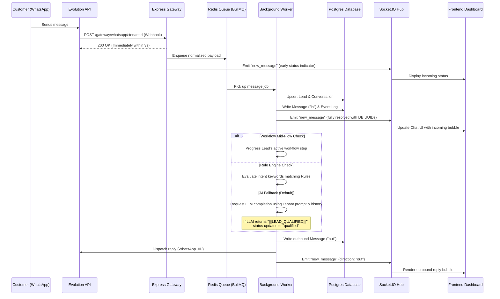

# Frontend Integration Specification & Technical Hand-off
**Project:** CRM V2 (Multi-tenant AI CRM Bot)  
**Target Audience:** Senior Frontend Developer  
**Status:** Backend Logic Complete & Verified  

---

## 1. System Overview & Tech Stack
The CrmV2 backend is a multi-tenant SaaS application designed to manage WhatsApp conversational bots, orchestrate automated AI workflows, track sales leads, and provide real-time agent chats.

### Tech Stack
*   **Runtime & Server:** Node.js, Express, TypeScript
*   **Database & ORM:** PostgreSQL, Prisma ORM
*   **Real-time Communication:** Socket.IO (WebSockets)
*   **Task Queue & Processing:** Redis, BullMQ (for asynchronous rate-limited webhook handling and AI reasoning pipelines)
*   **Messaging Integration:** Evolution API v2 (interfacing with WhatsApp Web via Baileys)
*   **AI Integration:** Groq, OpenAI, OpenRouter, and Gemini

---

## 2. Authentication Flow
Authentication is managed via JSON Web Tokens (JWT) with secure 1-hour access tokens and revokable 7-day refresh tokens.

### A. Authentication Mechanisms
1.  **Access Token:** Sent in the `Authorization` header as a Bearer token:
    `Authorization: Bearer <JWT_ACCESS_TOKEN>`
2.  **API Keys:** For external services, the system supports header-based API keys via:
    `X-API-KEY: <TENANT_API_KEY>`
3.  **WebSocket Authentication:** Must be supplied during the Socket.IO handshake using the `auth` payload or query parameters.

### B. Payload Structure
The JWT access token encodes the following payload:
```json
{
  "id": "usr_9b1deb4d-3b7d-4bad-9bdd-2b0d7b3dcbfa",
  "tenantId": "ten_8e4c7d0a-9d93-4a11-b0e2-1db179c3d4f1",
  "role": "admin" // admin, agent, viewer
}
```

---

## 3. Data Models (JSON Schema)

### A. User Model
Represents an operator or administrator belonging to a Tenant.
```json
{
  "id": "usr_9b1deb4d-3b7d-4bad-9bdd-2b0d7b3dcbfa",
  "clerkId": null, // Optional Clerk integration ID
  "tenantId": "ten_8e4c7d0a-9d93-4a11-b0e2-1db179c3d4f1",
  "email": "agent.smith@matrix.com",
  "name": "Agent Smith",
  "role": "admin", // admin, agent, viewer
  "createdAt": "2026-06-10T22:47:25.000Z",
  "updatedAt": "2026-06-10T22:47:25.000Z"
}
```

### B. Lead Model
Represents a customer/prospect. Leads are tenant-scoped and dynamically updated by the AI engine or rules.
```json
{
  "id": "led_330c6a8f-2877-4b71-b08e-3286bf5ea17f",
  "tenantId": "ten_8e4c7d0a-9d93-4a11-b0e2-1db179c3d4f1",
  "botId": "bot_a66d0c1e-9204-4b57-b088-29ef31d2ba51", // Bot currently handling the lead
  "name": "John Doe",
  "phone": "+1234567890",
  "email": "john.doe@example.com",
  "source": "whatsapp",
  "status": "contacted", // new, contacted, qualified, converted, lost
  "attributes": {
    "company": "Acme Corp",
    "interest": "Premium Plan",
    "estimatedValue": 500
  },
  "createdAt": "2026-06-10T22:47:25.000Z",
  "updatedAt": "2026-06-10T22:47:25.000Z"
}
```
> [!NOTE]
> By default, the `GET /api/leads` endpoint excludes leads with a status of `'new'` (i.e., cold contacts that have not engaged with the bot yet), unless requested explicitly via filtering query parameters.

### C. Message Model
Represents an individual message exchanged in a conversation.
```json
{
  "id": "msg_f7c6e1db-cb5b-43a0-8027-e4352db0c20f",
  "tenantId": "ten_8e4c7d0a-9d93-4a11-b0e2-1db179c3d4f1",
  "conversationId": "con_07a0e5b7-bd62-43bb-8a4e-128a307c91db",
  "direction": "in", // "in" (received from customer) or "out" (sent by agent/AI)
  "content": "Hello! I would like to get a quote.",
  "messageType": "text", // text, image, audio, video, document
  "platformMessageId": "BAE5D8749B90D85", // ID generated by WhatsApp/platform
  "metadata": {
    "sendStatus": "sent", // pending, sent, error
    "fileName": null, // Present if media message
    "mimeType": null, // Present if media message
    "hasMedia": false
  },
  "createdAt": "2026-06-10T22:47:25.000Z"
}
```

---

## 4. Bot Conversational Logic & Real-Time Setup

### A. Conversation Lifecycle


### B. WebSocket (Socket.IO) Live Events
The frontend should connect to the WebSocket server using the tenant-specific namespace and room:
*   **Connection URI:** `ws://<backend_url>/?token=<JWT_ACCESS_TOKEN>` (or `apiKey=<KEY>`)
*   **Auto-join Room:** On connection, the client is automatically joined to a room named after their `tenantId`.

#### Events Emitted by Server:
1.  **`new_message`:** Emitted when a new message is received or sent.
    ```json
    {
      "conversationId": "con_07a0e5b7-bd62-43bb-8a4e-128a307c91db",
      "message": {
        "id": "msg_f7c6e1db-cb5b-43a0-8027-e4352db0c20f",
        "direction": "in",
        "content": "Hello!",
        "createdAt": "2026-06-10T22:47:25.000Z"
      }
    }
    ```
2.  **`bot_status_change`:** Emitted when a bot shifts connectivity state.
    ```json
    {
      "botId": "bot_a66d0c1e-9204-4b57-b088-29ef31d2ba51",
      "status": "connected" // connected, disconnected, starting, error, pending_qr
    }
    ```
3.  **`qrcode.updated`:** Emitted during bot initialization to supply a new QR pairing code.
    ```json
    {
      "event": "qrcode.updated",
      "instance": "whatsapp_session_name",
      "data": {
        "qrcode": {
          "base64": "data:image/png;base64,iVBORw0KGgoAAA..."
        }
      }
    }
    ```
4.  **`connection.update`:** Real-time state updates from the WhatsApp instance connection.

---

## 5. API Documentation

All API endpoints are prefixed with `/api`. Standard responses include JSON data. Errors follow this schema:
```json
{
  "code": "DB_005",
  "detail": "Lead not found"
}
```

### A. Authentication
*   **`POST /api/auth/register`**
    *   **Description:** Creates a new Tenant and an Admin User simultaneously.
    *   **Body:**
        ```json
        {
          "email": "admin@tenant.com",
          "password": "SecurePassword123!",
          "tenantName": "Acme Enterprise",
          "name": "Jane Admin"
        }
        ```
    *   **Response (201):**
        ```json
        {
          "message": "Account registered successfully",
          "tenantId": "ten_8e4c7d0a-9d93",
          "userId": "usr_9b1deb4d"
        }
        ```
*   **`POST /api/auth/login`**
    *   **Description:** Exchanges credentials for tokens.
    *   **Body:**
        ```json
        {
          "email": "admin@tenant.com",
          "password": "SecurePassword123!"
        }
        ```
    *   **Response (200):**
        ```json
        {
          "message": "Login successful",
          "accessToken": "eyJhbGciOiJIUzI1Ni...",
          "refreshToken": "7cf8402db39df...",
          "tenantId": "ten_8e4c7d0a-9d93",
          "userId": "usr_9b1deb4d"
        }
        ```
*   **`POST /api/auth/refresh`**
    *   **Description:** Obtains a new access token using a refresh token.
    *   **Body:** `{ "refreshToken": "7cf8402db39df..." }`
    *   **Response (200):** `{ "accessToken": "...", "refreshToken": "..." }`
*   **`POST /api/auth/logout`**
    *   **Description:** Invalidates a refresh token.
    *   **Body:** `{ "refreshToken": "7cf8402db39df..." }`

### B. Workspace / Bot Management
*   **`GET /api/workspaces`**
    *   **Description:** Lists all bots associated with the tenant. Syncs live status with Evolution API in the background.
    *   **Response (200):**
        ```json
        {
          "workspaces": [
            {
              "id": "bot_a66d0c1e",
              "name": "Sales Bot",
              "platform": "whatsapp",
              "session_id": "whatsapp_170138294",
              "bot_active": true,
              "status": "connected",
              "whatsapp_status": "connected",
              "system_prompt": "You are a helpful assistant...",
              "ai_engine": "groq/llama-3",
              "groq_api_key": "***",
              "api_key": "***",
              "temperature": 0.7,
              "max_tokens": 1024,
              "created_at": "2026-06-10T17:18:00.000Z",
              "updated_at": "2026-06-10T17:18:00.000Z"
            }
          ]
        }
        ```
*   **`POST /api/workspaces`**
    *   **Description:** Spins up a new WhatsApp instance in Evolution API, then registers the bot in the DB.
    *   **Body:**
        ```json
        {
          "name": "Support Bot",
          "platform": "whatsapp",
          "system_prompt": "You answer tech questions...",
          "ai_engine": "groq/mixtral-8x7b",
          "api_key": "gsk_...",
          "temperature": 0.5,
          "max_tokens": 512
        }
        ```
*   **`PUT /api/workspaces/:id`**
    *   **Description:** Updates system prompt, model choices, temperature bounds, or custom keys.
*   **`DELETE /api/workspaces/:id`**
    *   **Description:** Permanently destroys the Evolution API container instance and removes the bot DB record.
*   **`POST /api/workspaces/:id/start`**
    *   **Description:** Re-connects instance. If QR pairing is needed, returns a `pending_qr` status containing the Base64 QR code.
    *   **Response (200):**
        ```json
        {
          "sessionInfo": { "status": "pending_qr" },
          "screenshotUrl": "data:image/png;base64,iVBOR..."
        }
        ```
*   **`POST /api/workspaces/:id/stop`**
    *   **Description:** Logs out and disconnects the WhatsApp session.
*   **`GET /api/workspaces/:id/connection-status`**
    *   **Description:** Queries the current real-time state of the WhatsApp instance. If starting/pending, returns the QR code.
*   **`POST /api/workspaces/:id/validate-key`**
    *   **Description:** Validates a specific LLM API key against the provider API.
    *   **Body (Optional):** `{ "provider": "groq", "key": "gsk_...", "model": "llama-3-8b" }`
    *   **Response (200):** `{ "valid": true, "error": null }`

### C. Lead Management
*   **`GET /api/leads`**
    *   **Query Params:** `status`, `platform`, `search`, `page`, `limit`
    *   **Response (200):**
        ```json
        {
          "leads": [
            {
              "id": "led_330c6a8f",
              "name": "Jane Smith",
              "phone": "+1999888777",
              "email": "jane@gmail.com",
              "source": "whatsapp",
              "status": "qualified",
              "createdAt": "2026-06-10T17:00:00.000Z",
              "conversations": [
                { "lastMessageAt": "2026-06-10T17:15:00.000Z", "platform": "whatsapp" }
              ],
              "_count": { "conversations": 1 }
            }
          ],
          "total": 1,
          "page": 1,
          "limit": 20
        }
        ```
*   **`GET /api/leads/:id`**
    *   **Description:** Gets a detailed lead structure containing conversation history and the latest 5 messages.
*   **`POST /api/leads`**
    *   **Description:** Manually creates a new lead.
    *   **Body:** `{ "name": "...", "phone": "...", "email": "...", "attributes": {} }`
*   **`PATCH /api/leads/:id`**
    *   **Description:** Updates lead status or key-value custom attributes.
*   **`DELETE /api/leads/:id`**
    *   **Description:** Deletes a lead and cascading assets.

### D. Conversations & Messages
*   **`GET /api/conversations`**
    *   **Query Params:** `status` (open/closed), `platform`, `leadId`, `page`, `limit`
*   **`GET /api/conversations/:id/messages`**
    *   **Description:** Returns messages inside a conversation (ordered ascending).
*   **`POST /api/conversations/:id/messages`**
    *   **Description:** Manually sends a text message from the agent interface. The message is sent to WhatsApp in the background.
    *   **Body:**
        ```json
        {
          "content": "Hi! Just following up.",
          "messageType": "text"
        }
        ```
*   **`POST /api/conversations/:id/media`**
    *   **Description:** Sends a file (image, audio, document, video) via Base64 encoding.
    *   **Body:**
        ```json
        {
          "base64": "data:image/png;base64,iVBORw0KG...",
          "messageType": "image", // image, audio, document, video
          "fileName": "quote.png",
          "mimeType": "image/png"
        }
        ```

### E. Analytics & Reporting
*   **`GET /api/analytics/message-volume`**
    *   **Query Params:** `days` (Default: 30), `platform`
    *   **Response (200):**
        ```json
        {
          "data": [
            { "date": "2026-06-10T00:00:00.000Z", "inbound": 45, "outbound": 60 }
          ]
        }
        ```
*   **`GET /api/analytics/conversion-funnel`**
    *   **Description:** Status counts for the lead funnel.
    *   **Response (200):**
        ```json
        {
          "funnel": [
            { "status": "contacted", "count": 22 },
            { "status": "qualified", "count": 14 }
          ]
        }
        ```
*   **`GET /api/analytics/dashboard-stats`**
    *   **Response (200):**
        ```json
        {
          "totalLeads": 134,
          "openConversations": 12,
          "messagesThisMonth": 2405,
          "activeBots": 2,
          "conversionRate": 25 // Percentage of qualified/converted leads
        }
        ```

### F. API Credentials & Keys
Allows users to manage API tokens for Groq, OpenAI, Gemini, etc.
*   **`GET /api/credentials`**
    *   **Response:** Masked preview values (`gsk_abcd***`).
*   **`POST /api/credentials`**
    *   **Body:** `{ "provider": "groq", "keyName": "Primary Key", "keyValue": "gsk_...", "isDefault": true }`
*   **`PUT /api/credentials/:id/default`**
    *   **Description:** Marks key as default provider choice.
*   **`DELETE /api/credentials/:id`**

### G. Team Management
*   **`GET /api/team`**
    *   **Response:** List of workspace members (`id`, `name`, `email`, `role`, `createdAt`).
*   **`PUT /api/team/:id/role`**
    *   **Body:** `{ "role": "admin" }` // admin, agent, viewer
*   **`DELETE /api/team/:id`**
    *   **Description:** Removes access for a teammate.

### H. Billing & Usage Metrics
*   **`GET /api/billing/usage`**
    *   **Description:** Aggregated message send/received counts and token calculations.
*   **`GET /api/billing/ai-logs`**
    *   **Description:** Raw tokens, cost metric, and models utilized per call.

---

## 6. Current Full Capabilities & Backend Features

The backend is 100% operational and implements the following features for the UI to consume:

1.  **Multi-Tenant Isolation:** Databases enforce strict Row-Level Security (RLS) policies scoped by `tenantId`. Handled seamlessly inside JWT verification.
2.  **QR Code Pairing & State Automation:** A workspace/bot status updates automatically. Starting a bot triggers the generation of a QR code base64 stream which is pushed to the frontend via Socket.io.
3.  **Real-Time Two-Way Chat:** Agents can view incoming messages instantaneously and reply using text or base64 file payloads.
4.  **Automatic AI Lead Classification:** When the AI converses with a lead and determines they meet qualifications (e.g. buying intent), it flags the backend with `|||LEAD_QUALIFIED|||`. The worker automatically marks the lead status as `qualified` and logs it.
5.  **Analytics Engines:** Includes pre-calculated conversion funnel graphs, message volume counters, and billing counters (BigInt conversions resolved).
6.  **Fail-Safe Idempotency & Rate Limiting:** Prevent processing duplicate webhook payloads or exhausting resources via Redis locks.
7.  **Global Middleware Error Boundary:** Standard API error definitions are pre-coded so frontend parsing can rely on HTTP Statuses + system codes (e.g. `DB_003`, `AUTH_003`).
